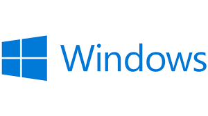
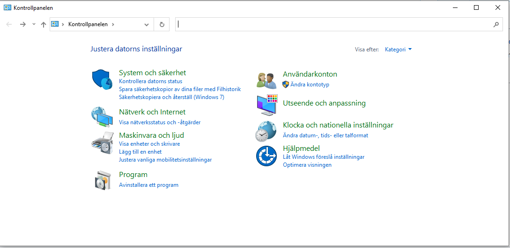
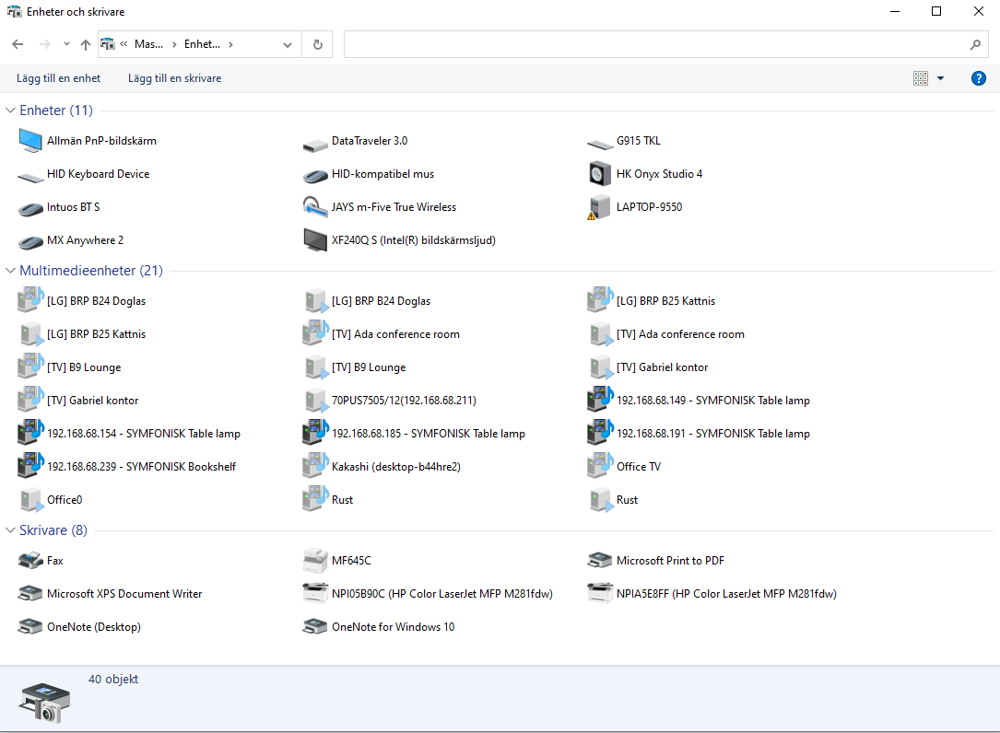
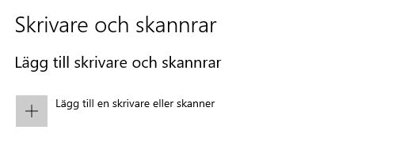
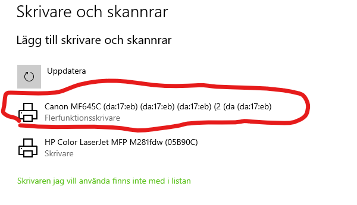
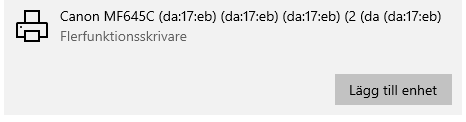
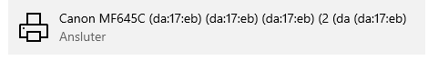
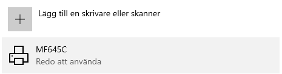
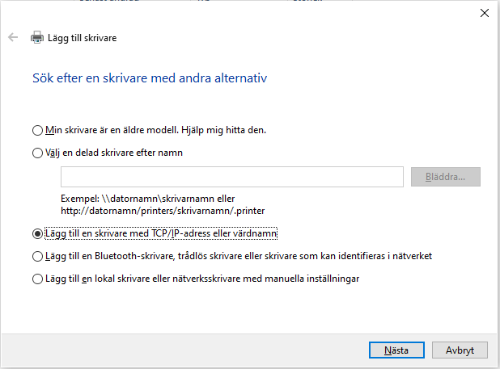

# Mjukvara och Operativssystem

 - Vanliga operativsystem och deras egenskaper.
 - Säkerhetskopiering och virusskydd.
 - Datorns start- och bootsekvenser samt inställning och uppgradering av
dess BIOS (Basic Input/Output System) eller firmware.
 - Kontroll och optimering av datorers och datorsystems prestanda och
funktion.
 - Installation och underhåll av lokal skrivare.

# Viktiga program 

- **Ordbehandling**
  - Word, Wordpad, Google Dokument, LibreOffice
- **PDF läsare**
  - [Adobe Acrobat](https://get.adobe.com/se/reader/) (Kanske ska vi installera?)
- **Webbläsare**
  - Google Chrome, Mocrosoft Edge, Brave, Firefox, Safari, Chromium

# Antivirus

- Absolut nödvändigt att ha installerat på sin dator
- Skyddar sin värd mot virus
- Uppdaterar sig själva

## Exempel på virusprogram
 [Länk till top 10 lista](https://www.techradar.com/best/best-antivirus)

- Norton 
- McAfee
- Avast
- Bitdefender
- Kaspersky
- Malwarebytes**

# BIOS

Basic Input/Output System

- Initierar och håller koll på maskinvaran mot OS
- Läser in datorn olika enheter vid uppstart
- Läser in vilken hårddisk OS ska startas ifrån

## BIOS 3 huvudfunktioner
- **Testrutiner**
  - går igenom huvudfunktionerna vid start eller omstart
- **Bootstrap**
  - startar inläsningen av operativssystemet
- **I/O-funktionerna**
  - Delen av BIOS som används under körning

## Komma in i BIOS

- Olika för olika datorer
- F2, Esc, Del, Alt-Esc, CTRL-Alt-Esc, F10, Alt-F2 m.m.
  - Beror på tillverkare och kan hittas i manual

# Datavirus
[Länk till Kjell](https://www.kjell.com/se/kunskap/hur-funkar-det/dator/dator-och-datasakerhet/de-digitala-hoten)
- Små program som kan infektera filer i dator och sprida sig till andra datorer
- Två typer av virus
  - Trojaner
    - Liknelse med trojanska hästen
    - Låtsas vara något annat för att bli installerat
    - Ligger i bakgrunden och spionerar eller släpper in annan skadlig kod
  - Maskar
    - Inte samma som subnet-mask
    - Sprider sig själva via nätverk och internet
    - Letar sig in via säkerhetshål
    - Förökar sig snabbt och kan överbelasta nätverk

# Vanliga operativsystem

- [Microsoft Windows](https://en.wikipedia.org/wiki/Microsoft_Windows)
- [macOS](https://en.wikipedia.org/wiki/MacOS)
- [Linux](https://en.wikipedia.org/wiki/Linux)
- [Android](https://en.wikipedia.org/wiki/Android_(operating_system))
- [iOS](https://en.wikipedia.org/wiki/IOS)
### Övriga:
- [Cisco IOS](https://en.wikipedia.org/wiki/Cisco_IOS)
# Allmänt om operativssystem
[Länk till definition (eng)](https://techterms.com/definition/operating_system)
- Mjukvara som pratar med hårdvaran
- Tillåter andra program att kunna köras via [API](https://techterms.com/definition/operating_system)
- De flesta har ett GUI (Graphical User Interface)
- Datorer, smartphones, routers m.m. har alla operativssystem

# macOS

- Baserat på Unix
- Senaste version macOS 12 Monterey

# iOS

- Operativssystemet för iPhone, Ipad

# Android

- Öppen källkod
- Bland annat utvecklat av Google

# Linux

- Linux är en [operativssystemskärna](https://sv.wikipedia.org/wiki/Operativsystemk%C3%A4rna), som Windows NT
- Är i sig själv inte ett komplett operativsssystem
- Öppen källkod
- Operativssystem som baseras på Linux
  - Ubuntu
  - CentOS
  - Linux Mint
  - Kali Linux

# Windows

- Windows 10 (snart 11)
  - Home, Pro, Enterprise och Education
  - FPP (Full Packaged Product), OEM, Volume Licensing
- Windows Server 2019 (snart 2022)
  - Standard och Datacenter
  - Core vs GUI
# Installera och hantera maskinvara i Windows 10

- Maskinvara är samma som hårdvara
- Maskinvara behöver drivrutiner för att fungera med mjukvaran

## Drivrutiner
- Program som låter hårdvara fungera med operativssystemet
- Olika drivrutiner för olika operativsssytem
- Windows har "Plug-n-play"
  - Installerar rätt drivrutin automatisk vid anslunting av maskinvara
- Intern hårdvara kräver omstart

# Kontrollpanelen

# Enheter och skrivare

# Installera  skrivare
1. Öppna Startmenyn
2. Välj Inställningar
3. Välj Enheter
4. Välj Skrivare och Skannrar
5. Välj Lägg till Skrivare eller skanner 

6. Välj skrivaren du vill lägga till 

7. Klicka på Lägg till enhet 

8. Vänta lite 

9. Klart!

### Om din skrivare inte dyker upp på listan vid steg 6

Klicka på "Skrivaren jag vill använda finns inte i listan"

Här kan vi lägga till skrivare med IP nummer som vi kan hitta på skrivaren

# Datorhanteraren

# Enhetshanteraren

# Windows Update
- HÅller koll på att operativssystemet hålls uppdaterat
- Söker normalt själv efter tillgängliga uppdateringar
- Går även att göra manuellt

# Windows Defender
- Inbyggt Antivirus-program i Windows 
- Anses inte vara tillräckligt skydd i sig själv

# Säkerhetskopiering
- Välj en hårddisk att säkerhetskopiera till
- Välj hur ofta säkerhetskopieringen ska göras

## Rekommendationer om säkerhetskopiering
- SÄkerhetskopiera ofta
- Spara flera säkerhetskopior
- Spara säkerhetskopiorna på en säker plats
- VÄlj vad som ska säkerhetskopieras

###SÄkerhetskopiering på företag
 - Bandstationer
 - Molnbaserad säkerhetskopiering

### Säkerhetskopiering hemma
- Externa hårddiskar
- DVD skivor
- NAS

### Filhistorik
- Återställ filer till tidigare verisoner

### Återställning
- Återställning är ett hjälpmedel i windows
- Innebär ominstallation av hela Windows
- Går att välja att spara sina filer
- Avancerad start tillåter återställning från en tidigare Systemavbildning (backup)

http://itlararen.se/daodac02019.html
http://itlararen.se/videos/windows/win01.html

# IT-läraren

Övningar:
- [DOS kommandon](http://itlararen.se/labbar/doc-DOS_kommandon.pdf)
- [DOS kommandon - Övningar](http://itlararen.se/labbar/doc-DOS_kommandon-%C3%B6vningar.pdf)

Gör dessa quiz:
- [Operativssystem Intoduktion](http://itlararen.se/quiz/quiz33.html)
- [Windowshistorik och versioner](http://itlararen.se/quiz/quiz34.html)
- [Skrivare och tillbehör](http://itlararen.se/quiz/quiz32.html)

Några kahoot Quiz
- [Windows 10 Installation](http://itlararen.se/videos/windows/win102.html)
- [Windows Versioner](http://itlararen.se/videos/windows/win101.html)
- [Windows 10 GUI](http://itlararen.se/videos/windows/win103.html)