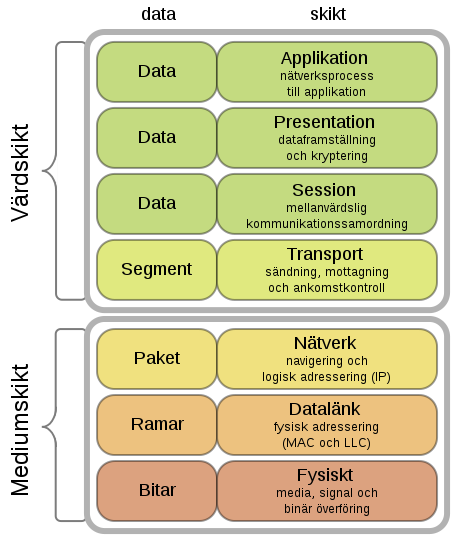
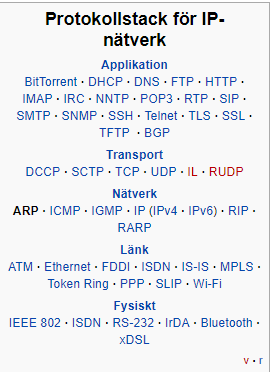
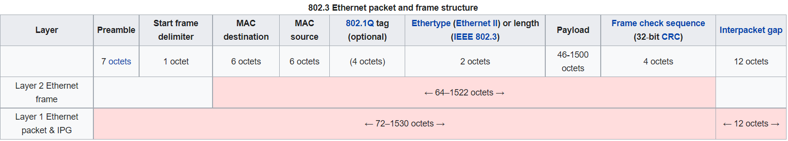
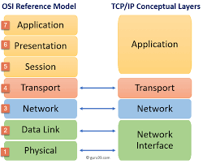
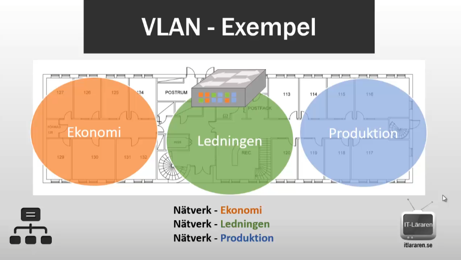

# Nätverk - Repetition

### Centralt innehåll

- Protokoll för dataöverföring via nätverk.
- Begreppen switchning och routning.
- Begreppet virtuella nät.
- Lokala nätverk, uppbyggnad och arbetssätt.

# Videolänkar till IT-läraren
- [Begrepp och standarder](https://itlararen.se/videos/network/network38.html)
- [Protokoll och standdarder del 1](https://itlararen.se/videos/network/network2.html)
- [Begrepp del 2](https://itlararen.se/videos/network/network39.html)
- [TCP IP Introduktion](https://itlararen.se/videos/network/network40.html)
- [Ehternet](https://itlararen.se/videos/network/network42.html)
- [IPv4 Del 1](https://itlararen.se/videos/network/network43.html)
- [IPv4 Del 2](https://itlararen.se/videos/network/network44.html)
- [IPv4 Del 3](https://itlararen.se/videos/network/network45.html)
- [ARP](https://itlararen.se/videos/network/network46.html)
- [UDP](https://itlararen.se/videos/network/network48.html)
- [TCP Del 1](https://itlararen.se/videos/network/network49.html)
- [TCP Del 2](https://itlararen.se/videos/network/network50.html)
- [Routing och NAT](https://itlararen.se/videos/network/network5.html)
- [VLAN och Switchar](https://itlararen.se/videos/network/network22.html)
- [Routing Fördjupning - Introduktion och statisk routing](https://itlararen.se/videos/network/network23.html)

# Nätverk 

- Kommunikation i ett nätverk kan gå trådlöst eller via kabel
- Vanligaste överföringstekniken är Ethernet

# Protokoll för dataöverföring via nätverk.

- Ethernet frame är inuti data link lagret, lager 2 i OSI-modellen
  - Använder det fysiska lagrets transportmekansimer, lager 1
    - Innehåller sändar- och mottagaradress
    - Max 1500 byte data i varje paket
- Ethernet packet

- [MAC-Adress](https://sv.wikipedia.org/wiki/MAC-adress)
- [IP](https://sv.wikipedia.org/wiki/Internetprotokoll)
- [ARP](https://sv.wikipedia.org/wiki/Address_Resolution_Protocol)
- [IPv4](https://sv.wikipedia.org/wiki/IPv4)
- [TCP](https://sv.wikipedia.org/wiki/Transmission_Control_Protocol)

# Begreppen switchning och routning.

# Switch
[Var är en switch?](https://www.induo.com/b/vad-ar-switch/)

- Används för att ansluta flera nätverksenheter med varandra
- Är inte "dum" till skillnad från en hub
- Switchen har ARP
- Switchen skickar (forwards) data mellan enheter till skillnad från routern som skickar data mellan nätverk 
- Managed switch innebär att portarna kan konfigureras via mjukvara
- Switchen öppnar och stänger dataflöde baserat på information i Ethernet frame och ARP

# Router

[Router Hur funkar det? - Kjell](https://www.kjell.com/se/kunskap/hur-funkar-det/internet/lokala-natverk/routern)

- 

# Routingprocessen

## Six degrees of Kevin Bacon

- [Default Gateway](https://www.fixanatet.se/grundkunskap/default-gateway-att-hitta-till-andra-ip-nat/)
- [Routingtabell]()
- [TTL-värde (Time-to-Live)]

I kommandotolken
`tracert gp.se`

- Kontrollerar hur många roterhopp som görs

# Begreppet virtuella nät.
## VLAN

###IT-Läraren Video - [VLAN och Switchar](https://itlararen.se/videos/network/network22.html)

- Delar upp vårt nätverk i olika (logiska) delar
- Logisk uppdelning på lager 2
- Kräver en managed level 2 switch

### Exempel:
- En switch per avdelning
  - Bättre säkerhet än med en switch för alla avdelningar

- Switchar i ett serverrum
  - I verkligheten sitter inte alla på samma ställe

- 3 Virtuella LAN via en managed switch
  - Bättre möjlighet att konfigurera via nätverket utan att behöva gå till serverrummet

# Lokala nätverk, uppbyggnad och arbetssätt.