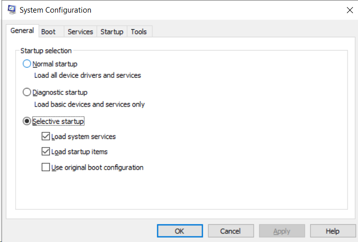
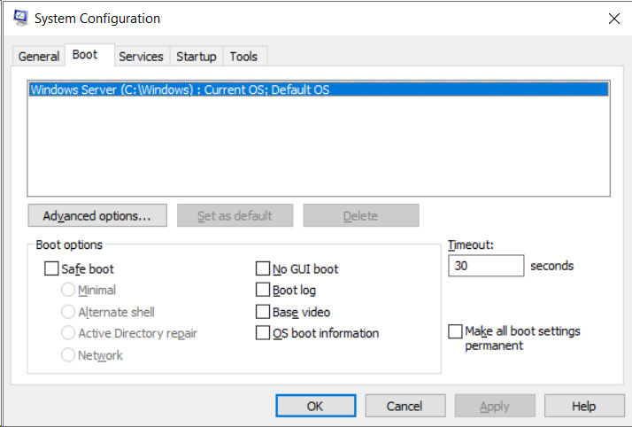
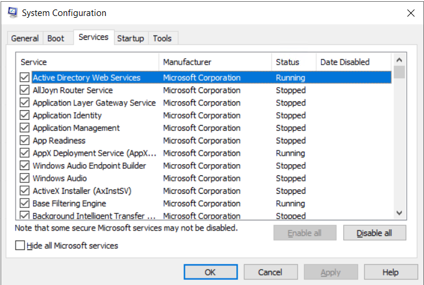
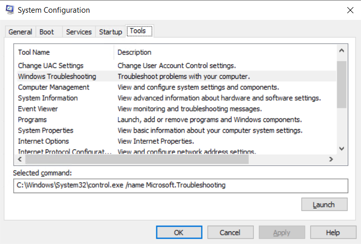
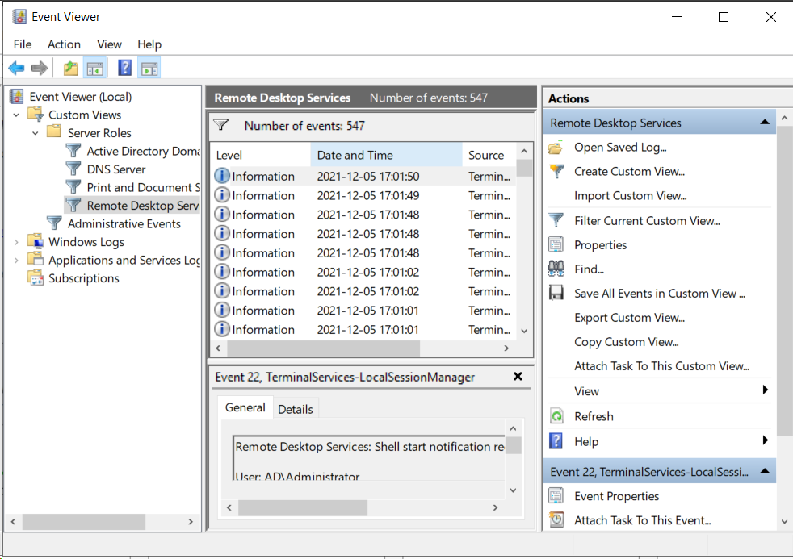

# Dagens Agenda

* Prestanda, optimering och felsökning
* Active Directory och GPOs
* 
* Powershell

---
# Prestanda

* Resursövervakning
  * Övervaka användningen av resurser i Datorn
    * Minne, CPU, hårddisk och Nätverk
    * Leta efter flaskhalsar i systemet
* 3 huvudsakliga verktyg i Windows
  * Aktivitetshanteraren / Task Manager
  * Resursövervakaren / Resource monitor
  * Prestandaövervakaren / Performance monitor
## Läs sidorna 211 - 226 i kurslitteraturen

---

# Förbättra prestanda

* Hitta flaskhalsar genom övervakning
* Åtgärder för att förbättra datorns prestanda
  * Analysera och förbättra datorns hårdvara
    * Internminne
    * Processor (CPU)
    * Hårddisk
    * Nätverk
  * Använda mindre krävande mjukvara
    * Windows Server Core tar bort grafiska funktioner
      * Frigör mycket resurser
  *  Optimera hur operativssystemet använder resurser

[Tips för att förbättra datorns prestanda i Windows](https://support.microsoft.com/sv-se/windows/tips-f%C3%B6r-att-f%C3%B6rb%C3%A4ttra-datorns-prestanda-i-windows-b3b3ef5b-5953-fb6a-2528-4bbed82fba96#Category=Windows_10)

---

# Optimering

* Prioritering i task manager
* Avancerade systeminställningar
  * Visuella effekter
    * Ställ in hur mycket av datorn prestanda som ska läggas på grafiskt utseende
  * Avancerat
    * Prioritera Program eller Bakgrundstjänster

---
# Felsökning och felhantering

* Säkerhet och underhåll / Security and Maintenance
  * Tidigare "Åtgärdscenter / Action Center"
  * Samlad information om datorproblem, underhåll och problemlösningar
* Felsökaren
  * Start     > Inställningar  > Uppdatering och säkerhet  > Felsök
  * Kräver kod för Windows Server Evaluation
  * Ytterligare Felsökare i Windows 10 

---
## Avancerade startalternativ

* Tryck på F8 direkt efter uppstart

---

## System Configuration #1
* General

---
## System Configuration #2
* Boot

---
## System Configuration #3
* Services

---
## System Configuration #4
* Tools

---
## Program för felsökning av datorer

* Memtest86+: Testar minnet i en dator
* Seatools: Testar hårddiskar för fel genom SMART
* Smartctl – linux: Samma som Seatools men generell och finns bara i linux
* Resource Monitor: Windows inbyggda resursverktyg
* HWmonitor: Kan visa spänningar, temperaturer, klockfrekvens osv
* Prime95: Stresstestar processorn och ser om den kraschar eller blir varm
* CPU Z: Visar information om processorn
* CrystalDiskMark: Benchmarkar hårddiskar och SSD:er
* CrystalDiskInfo: Visar information om hårddiskar och SSD:er
* Hddregenerator: Rensar diskar från data om jag inte minns fel
* Diskmanager: Hanterar partitioner och volymer i Windows
* GetBackData: Räddar data från trasiga hårddiskar och partition

---  
# Loggboken / Event Viewer

---
# Active Directory

