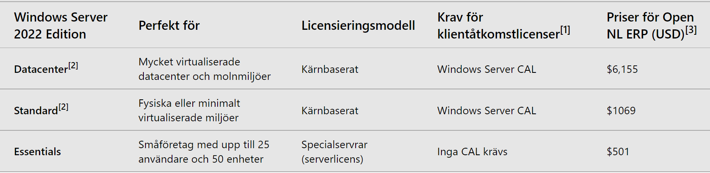
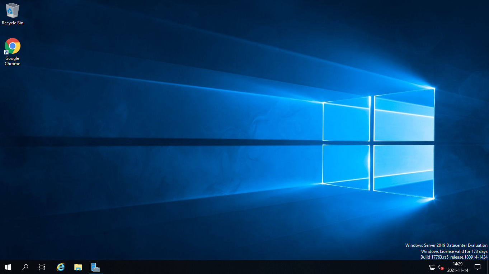
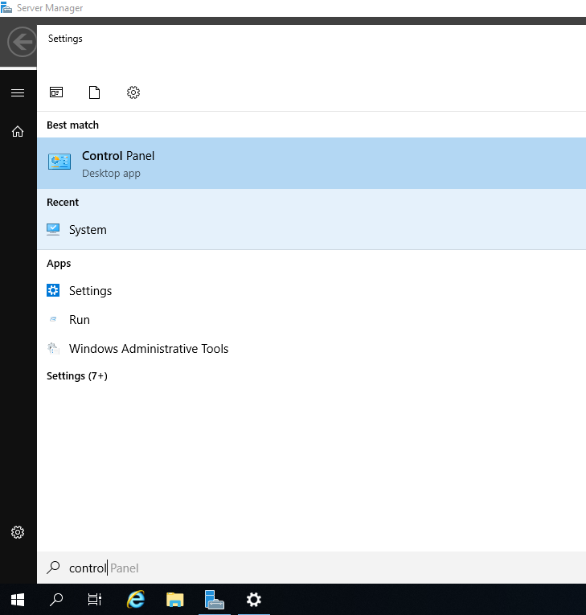
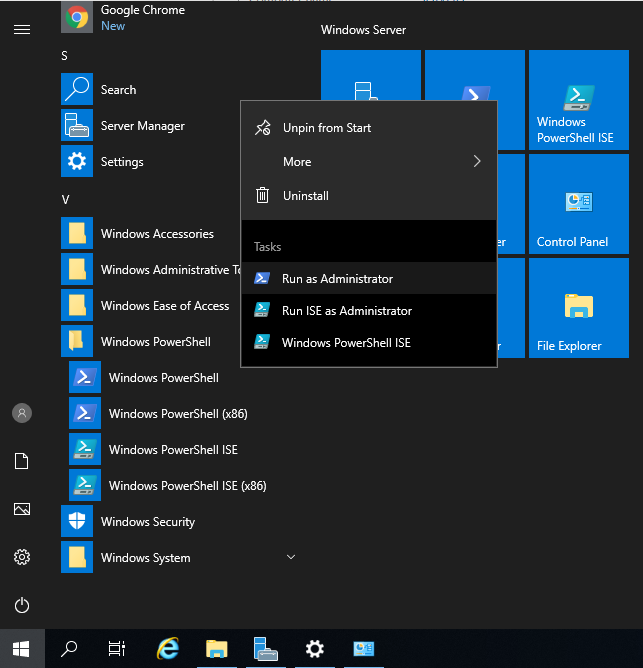
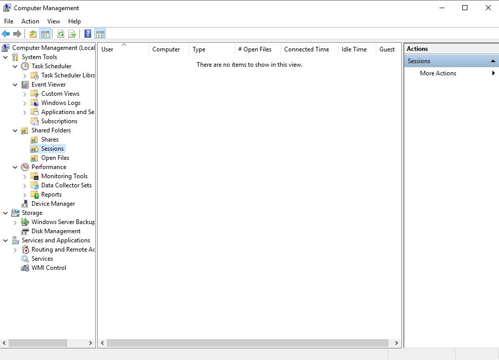
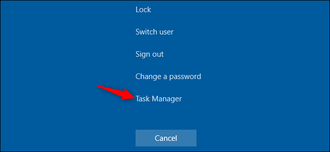

# Windows Server

- [Windows Server](#windows-server)
    - [Utgåvor](#utgåvor)
    - [Hårdvarukrav](#hårdvarukrav)
    - [Installation av Windows Server](#installation-av-windows-server)
    - [Åtgärder efter installation](#åtgärder-efter-installation)
  - [Det grafiska gränssnittet](#det-grafiska-gränssnittet)
    - [Skrivbordet](#skrivbordet)
    - [Startmenyn](#startmenyn)
    - [Sök](#sök)
    - [Inställningar](#inställningar)
    - [Kontrollpanelen](#kontrollpanelen)
    - [Utforskaren](#utforskaren)
    - [Kör program som administratör](#kör-program-som-administratör)
    - [Administrativa Verktyg i kontrollpanelen](#administrativa-verktyg-i-kontrollpanelen)
    - [Aktivitetshanteraren/Task Manager](#aktivitetshanterarentask-manager)
    - [System Information](#system-information)
    - [System Configuration](#system-configuration)
    - [Datorhanteraren/Computer Management](#datorhanterarencomputer-management)
    - [Powershell (lägg till i aktivitetsfältet)](#powershell-lägg-till-i-aktivitetsfältet)
  - [Snabbkommandon](#snabbkommandon)
    - [Ctrl-Alt-Delete](#ctrl-alt-delete)
  - [Praktiska uppgifter kapitel 1](#praktiska-uppgifter-kapitel-1)
    - [1.1 Installera Windows Server](#11-installera-windows-server)
- [Lagen om upphovsrätt](#lagen-om-upphovsrätt)
  - [Lag (1960:729) om upphovsrätt till litterära och konstnärliga verk](#lag-1960729-om-upphovsrätt-till-litterära-och-konstnärliga-verk)
    - [1 Kap. Upphovsrättens föremål och innehåll](#1-kap-upphovsrättens-föremål-och-innehåll)
      - [Särskilda bestämmelser om datorprogram m.m.](#särskilda-bestämmelser-om-datorprogram-mm)
      - [Skydd för tekniska åtgärder](#skydd-för-tekniska-åtgärder)
  - [Licensformer för fri användning](#licensformer-för-fri-användning)
    - [Vanliga Licensmodeller för programvaror](#vanliga-licensmodeller-för-programvaror)
      - [Köpelicenser](#köpelicenser)
      - [Hyrlicenser / Prenumeration](#hyrlicenser--prenumeration)
      - [OEM-Licenser, Original Equipment Manufacturer](#oem-licenser-original-equipment-manufacturer)
    - [Windows Licenser](#windows-licenser)
      - [CAL-licenser, Client Access License](#cal-licenser-client-access-license)
      - [Terminal Server](#terminal-server)
      - [Volym Licens](#volym-licens)
      - [SA, Software Assurance](#sa-software-assurance)
      - [OVS, Open Value Subscription](#ovs-open-value-subscription)
      - [Licenser för Microsofts Serverprodukter](#licenser-för-microsofts-serverprodukter)
  - [Instuderingsuppgift kapitel 2](#instuderingsuppgift-kapitel-2)
    - [2.1 Licenser för Windows Server](#21-licenser-för-windows-server)
  - [Praktiska uppgifter kapitel 3](#praktiska-uppgifter-kapitel-3)
    - [3.1 Powershell](#31-powershell)
- [Avancerat Uppdrag](#avancerat-uppdrag)

### Utgåvor

Windows server 2012 har 4 olika utgåvor:

1. Foundation
2. Essentials
3. Standard
4. Datacenter

Windows Server 2022 har 3:

1. Essentials
2. Standard
3. Datacenter

### Hårdvarukrav
Processor: 1,4 Ghz 64-bit

Minne: 512 MB

Disk: 32 GB

### Installation av Windows Server

Vi har 4 versioner att välja mellan:
    1. Standard Core
    2. Standard Desktop Experience
    3. Datacenter Core
    4. Datacenter Desktop Experience

I windows server 2012 går det att hoppa mellan Core versionen och det med Grafiskt gränssnitt, detta är dock inte möjligt sedan Windows Server 2016.

Övning  på detta finns i i detta dokumentet, se [1.1 Installera Windows Server](#11-installera-windows-server)

### Åtgärder efter installation

* Konfigurera Nätverksinställningar
   * En server bör ha en fast IP-adress
   * För virtualiserad server krävs konfiguration av virtuella switchar i Hyper-V
* Ställ in datum och tid samt tidszon och land
* Kontrollera om eventuella uppdateringar kan/bör göras samt konfigurera automatiska uppdateringar. Automatiska uppdateringar är avstängda från början.
* Aktivera Windows (Behövs inte i vårt fall)
* Eventuell ändra nätverksinställnignar för IE

## Det grafiska gränssnittet
### Skrivbordet

### Startmenyn

### Sök

### Inställningar

### Kontrollpanelen

### Utforskaren

### Kör program som administratör

Vi måste ibland köra program som administratör för att kunna ändra på inställningar som kräver administratörsrättigheter

### Administrativa Verktyg i kontrollpanelen

### Aktivitetshanteraren/Task Manager

### System Information

### System Configuration

### Datorhanteraren/Computer Management

Finns i Windows 10 också:

### Powershell (lägg till i aktivitetsfältet)

Även när Powershell nu är stängt så ligger ikonen lättillgänglig i aktivitetsfältet

## Snabbkommandon
Det är samma snabbkommandon som gäller både i Windows 10 och i Windows Server '
[Lista på kortkommandon att testa](https://support.microsoft.com/sv-se/topic/lista-%C3%B6ver-kortkommandon-som-%C3%A4r-tillg%C3%A4ngliga-i-windows-xp-1b52803c-c206-fe8c-1b6e-7516523cd4fc)

### Ctrl-Alt-Delete

När vi använder kortkommandot Ctrl-Alt-Delete kan vi snabbt komma åt aktivitetshanteraren och ett par andra funktioner.
Vi får även ett par andra alternativ:

OBS! När vi är inne i en VM och använder kortkommandot Ctrl-Alt-Delete så är det inte den virtuella maskinen vi matar in kommandot i, utan vår host dator. För att mata in Ctrl-Alt-Delete i en VM så finns det andra alternativ.

## Praktiska uppgifter kapitel 1

### 1.1 Installera Windows Server
Du ska installera Windows Server på antingen en ny virtuell maskin, genom hyper-v, på din dator eller en av de stationära datorerna i klassrummet.

Efter installationen ska du utföra de inledande stegen för att konfigurera servern. Fråga lärare om vilket IP-nummer du ska använda.

För anteckningar över frågor som dyker upp

# Lagen om upphovsrätt

## Lag (1960:729) om upphovsrätt till litterära och konstnärliga verk

### 1 Kap. Upphovsrättens föremål och innehåll

**1 §**  Den som har skapat ett litterärt eller konstnärligt verk har upphovsrätt till verket oavsett om det är

1. skönlitterär eller beskrivande framställning i skrift eller tal,
2. datorprogram,
3. musikaliskt eller sceniskt verk,
4. filmverk,
5. fotografiskt verk eller något annat alster av bildkonst,
6. alster av byggnadskonst eller brukskonst, eller
7. verk som har kommit till uttryck på något annat sätt.

Till litterära verk hänförs kartor, samt även andra i teckning eller grafik eller i plastisk form utförda verk av beskrivande art.

Vad som i denna lag sägs om datorprogram skall i tillämpliga delar gälla även förberedande designmaterial för datorprogram.
*Lag (1994:190)*.

**2 §**  Upphovsrätt innefattar, med de inskränkningar som föreskrivs i det följande, uteslutande rätt att förfoga över verket genom att framställa exemplar av det och genom att göra det tillgängligt för allmänheten, i ursprungligt eller ändrat skick, i översättning eller bearbetning, i annan litteratur- eller konstart eller i annan teknik.

Framställning av exemplar innefattar varje direkt eller indirekt samt tillfällig eller permanent framställning av exemplar av verket, oavsett i vilken form eller med vilken metod den sker och oavsett om den sker helt eller delvis.

#### Särskilda bestämmelser om datorprogram m.m.

**26 g §**  Den som har förvärvat rätt att använda ett datorprogram får framställa sådana exemplar av programmet och göra sådana ändringar i programmet som är nödvändiga för att han skall kunna använda programmet för dess avsedda ändamål. Detta gäller även rättelse av fel.

Den som har rätt att använda ett datorprogram får framställa säkerhetsexemplar av programmet, om detta är nödvändigt för den avsedda användningen av programmet.

Exemplar som framställs med stöd av första eller andra stycket får inte utnyttjas för andra ändamål och får inte heller användas när rätten att utnyttja programmet har upphört.

Den som har rätt att använda ett datorprogram får iaktta, undersöka eller prova programmets funktion för att fastställa de idéer och principer som ligger bakom programmets olika detaljer. Detta gäller under förutsättning att det sker vid sådan laddning, visning på skärm, körning, överföring eller lagring av programmet som han har rätt att utföra.

Den som har rätt att använda en sammanställning får förfoga över den på det sätt som är nödvändigt för att han skall kunna använda sammanställningen för dess avsedda ändamål.

Avtalsvillkor som inskränker användarens rätt enligt andra, fjärde eller femte stycket är ogiltiga. *Lag (1997:790)*.

**26 h §**  Återgivning av ett datorprograms kod eller översättning av kodens form är tillåten om åtgärderna krävs för att få den information som är nödvändig för att uppnå samverkansförmåga mellan programmet och ett annat program. Detta gäller dock endast under förutsättning att följande villkor är uppfyllda:

1. åtgärderna utförs av en person som har rätt att använda programmet eller för hans räkning av en person som har fått rätt att utföra åtgärderna,
2. den information som är nödvändig för att uppnå samverkansförmåga har inte tidigare varit lätt åtkomlig för de i 1 angivna personerna och
3. åtgärderna är begränsade till de delar av originalprogrammet som är nödvändiga för att uppnå den avsedda samverkansförmågan.

Första stycket innebär inte att informationen får

1. användas för andra ändamål än att uppnå den avsedda samverkansförmågan,

2. överlämnas till andra personer, utom när detta är nödvändigt för att uppnå den avsedda samverkansförmågan,
3. användas för utveckling, tillverkning eller marknadsföring av ett datorprogram som i förhållande till det skyddade programmet har en väsentligen likartad uttrycksform eller
4. användas för andra åtgärder som utgör intrång i upphovsrätten.

Avtalsvillkor som inskränker användarens rätt enligt denna paragraf är ogiltiga. *Lag (1993:1007)*.

#### Skydd för tekniska åtgärder

**52 d §**  Det är förbjudet att utan samtycke från upphovsmannen eller dennes rättsinnehavare kringgå en digital eller analog spärr som hindrar eller begränsar framställning av exemplar av ett upphovsrättsligt skyddat verk, kringgå en teknisk skyddsprocess, exempelvis en kryptering, som hindrar eller begränsar tillgängliggörande för allmänheten av ett upphovsrättsligt skyddat verk eller kringgå en annan teknisk åtgärd som hindrar eller begränsar sådant tillgängliggörande.

Första stycket gäller inte när någon som lovligen har tillgång till ett exemplar av ett upphovsrättsligt skyddat verk, kringgår en teknisk åtgärd för att kunna se eller lyssna på verket. *Lag (2005:359)*.

**52 e §**  Det är förbjudet att tillverka, importera, överföra, sprida genom att exempelvis sälja eller hyra ut, eller i förvärvssyfte inneha anordningar, produkter eller komponenter eller att tillhandahålla tjänster som

1. marknadsförs eller utannonseras i syfte att kringgå en teknisk åtgärd,
2. utöver att kringgå en teknisk åtgärd endast har ett begränsat intresse från förvärvssynpunkt eller ett begränsat förvärvsmässigt användningsområde, eller
3. huvudsakligen är utformade, konstruerade, anpassade eller framtagna i syfte att möjliggöra eller underlätta kringgående av en teknisk åtgärd. *Lag (2005:359)*.

## Licensformer för fri användning

* Shareware
  * Ex. Windows Server 2019 Evaluation
* Freeware
  * Google Chrome, Adobe Acrobat Reader 
* Open Source/Öppen källkod
  * Linux
* BSD
  * FreeBSD (MAC OSX bygger på FreeBSD)
* GNU General Public License
* Fritt Innehåll/ Public Domain
  * Creative Commons (Wikipedia)

### Vanliga Licensmodeller för programvaror

#### Köpelicenser

#### Hyrlicenser / Prenumeration

#### OEM-Licenser, Original Equipment Manufacturer

### Windows Licenser

#### CAL-licenser, Client Access License

Behövs för att en företagsanvändare ska kunna ansluta till en server.
Det behövs en CAL-licens för varje samtidigt ansluten användare eller datorenhet.

Det finns möjlighet att köpa CAL-licenser **per user** eller **per device**

#### Terminal Server

Inte aktuellt sen Server 2012

#### Volym Licens

EN modell anpassad för större organisationer, Windows 10 Enterprise är en typ av volymlicens 

#### SA, Software Assurance

Microsofts namn på en typ av licens som ger rätt till fria uppgraderingar av programvaran. Har man t.ex köpt Windows Server 2019 med SA har man rätt att uppgradera till Windows 2022.

#### OVS, Open Value Subscription

Renodlat hyresavtal för företag med minst 5 licenser. Tecknas över 3 år och i avtalet kan det ingå volymlicenser till Microsofts olika programvaror och operativssystem (Office, Windows Server, CAL:ar m.m.).

#### Licenser för Microsofts Serverprodukter

Ett flertal av Microsofts serverprodukter, som körs på en Windows Server, är licensierade. Ex. Exchange Server (mailserver), SQL Server (Databasserver) och Lync Server/ Skype for Business(meddelande och telefoni)

## Instuderingsuppgift kapitel 2
### 2.1 Licenser för Windows Server
Vilka och hur många licenser av Windows Server 2012 (Serverlicens samt CAL) behövs i nedanstående fall? *(det går bra att svara för 2019 eller 2022)*

En server dator med 5 samtidigt anslutna användare med var sin dator:

Två virtuella servrar (Hyper-V) på samma fysiska server med 10 samtidigt anslutna datorer på vilka 40 olika användare kan logga in (dock ej samtidigt):

Fyra fysiska servrar i en domän med 50 samtidigt anslutna användare. Användarna har både en stationär och en bärbar dator:

## Praktiska uppgifter kapitel 3
### 3.1 Powershell

Bekanta dig nu med Powershell.

Använd lämpliga kommandon för att navigera runt i mapparna på servern.

Lista alla filer i mappen **C:\Windows\System32**

Skapa en ny mapp under **C:\** med namnet **Testmapp**

Skapa en ny mapp under **C:\Testmapp** med namnet **Filer**

För anteckningar över vilka kommandon du har använt och hur du tog reda på dessa

# Avancerat Uppdrag

Istället för att använda dig av din skoldator och Hyper-V för att sätta upp en Testmiljö för Windows Server ska du använda de stationära datorerna som finns på skolan. Denna Dator ska sedan köra Hyper-V i första lagret och därefter ska en Windows Server 2019 virtualiseras däri.

Börja med att skapa ett dokument och spara nyckel och dylikt till det nuvarande operativssystemet ifall vi behöver återställa datorerna till Windows 10.

Installera Windows Server 2019 Datacenter Desktop Experience på datorn.

Aktivera Rollen Hyper-V via Server Manager

Skriv ett script med powershell som skapar en VM med Windows Server, aktiverar rollen Active Directory Domain Services och gör servern till domänkontrollant.

Skriv sedan ett powershell script för att lägga till organisational units och användare så som IST2108 discord kanalen är organiserad. Detta scriptet måste köras i Domänkontrollanten och inte i Host OSet.

Skapa en extern virtuell switch som du delar hostens NIC med.

Koppla sedan in en fysisk switch och anslut din skoldator till domänen. 

