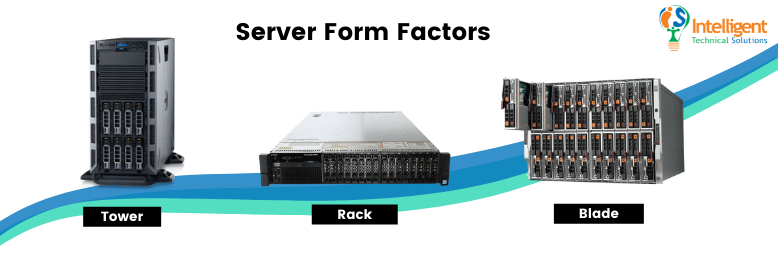
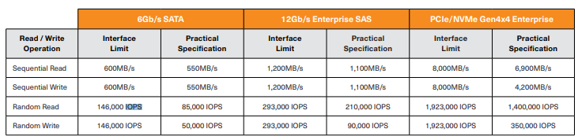
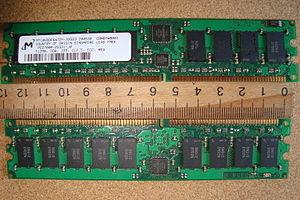
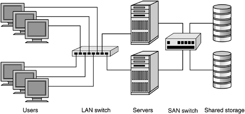

**Dagens agenda**

- [Dagens Agenda](#dagens-agenda)
- [Serverdatorn](#serverdatorn)
  - [Serverdatorn forts.](#serverdatorn-forts)
  - [Hårddiskar för servers](#hårddiskar-för-servers)
  - [Minnen för servers](#minnen-för-servers)
- [Virtualisering](#virtualisering)
  - [Driftsäkerhet vid virtualisering](#driftsäkerhet-vid-virtualisering)
  - [Hantera virtuella maskiner i Hyper-V](#hantera-virtuella-maskiner-i-hyper-v)
- [Filserver](#filserver)
  - [Olika Lagringslösningar](#olika-lagringslösningar)
  - [SAN Logisk topologi](#san-logisk-topologi)
- [Webbserver](#webbserver)
  - [Sätt upp rollen web server](#sätt-upp-rollen-web-server)
- [Prestanda, Optimering och Felsökning](#prestanda-optimering-och-felsökning)
- [Instuderingsfrågor](#instuderingsfrågor)
  - [6. Serverdatorn](#6-serverdatorn)
---
# Dagens Agenda
* Serverdatorn
* Virtualisering  
* Filserver
* Webbserver
* Prestanda, Optimering och Felsökning
* Övervakning och granskning

---

# Serverdatorn

* I grund och botten en helt vanlig persondator
* Optimeras för att fungera som server i ett nätverk eller mot internet
  *   Ofta flera parallellt arbetande processorer
  *   Mycket internminne
* Mer fokus på bra kylning än ljudnivå
* Kör ofta RAID för hög driftsäkerhet och snabbare läsning
* Ofta redundanta nätverkskort och PSUer

---

## Serverdatorn forts.
* Olika formfaktorer
  * Tower
  * Rack
  * Blade
    * Moduluppbyggd
    * Varje modul är en egen server

---

## Hårddiskar för servers
* Olika Hårddiskinterface att välja mellan
* IOPS - Input/Output Operations per Second
  * HDD SATA - 75 IOPS
  * HDD SAS - 150 IOPS 
  * SSD SATA
  * SSD SAS - 160.000/50.000 IOPS
  * SSD NVME - över 500 000 IOPS

---

## Minnen för servers
* RDIMM vs DIMM
  * RDIMM har ett register som
    * Ökar stabilitet och kapacitet
* ECC - Error Correction Code
  * Förhindrar data korruption och resulterande krashar
* Viktigt att placera minnesmodulerna på rätt plats i servern vid installation

---

# Virtualisering  
* Installera flera OS i samma fysiska server
* Lägre kostnad för maskinvara
* Enklare att backupa och köra redundanta VMs
* Lätta att tilldela mer resurser
* Virtualiseringsprogramen tillåter konfigurering och styrning 
* Går att flytta mellan olika fysiska servrar under drift
* Olika virtualiseringsprogram (Hypervisors):
  * Hyper-V
  * VMWare
  * VirtualBox
* Type 1 vs Type 2 Hypervisors

---

## Driftsäkerhet vid virtualisering
* Driftsäkerhet försämras då flera VM körs i samma fysiska maskin
* Man ökar driftsäkerheten genom att:
  * Använda speglade diskar, RAID 1, 5, 6 eller 10
  * Använda en server med dubblas PSUer
  * Använda UPS 
  * Dubbla nätverkskort och två switchar
  * Använda bra system för driftsövervakning
* Driftsäkerheten i VM är bättre på vissa punkter:
  * Lättare att säkerhetskopiera och skapa redundanta lösningar
  * Lättare att återskapa vid serverkrash (om förberedelse gjorts)

---

## Hantera virtuella maskiner i Hyper-V
* **Connect/Anslut** 
* **Settings/Inställningar** 
* **Start** 
* **Snapshot/Kontrollpunkt** 
* **Revert/Återställ till ögonblicksbild** 
* **Move/Flytta** 
* **Export/Exportera** 
* **Rename/Byt namn** 
* **Delete/Ta bort** 
 

---

# Filserver

* Central lagring för användares filer
  * Tillåter åtkomst från olika datorer och platser.
  * Bra om flera ska ha åtkost till samma filer och mappar
  * Säkerhetskopior görs lättare
  * Billigare 

---

## Olika Lagringslösningar
* Serverdator med hårddiskar
* SAN - Storage Area Network
  * Består av en serverenhet med plats för många hårddiskar
  * Används av medelstora och större företag samt på datacenter
* NAS - Network Attached Storage
  * Har ofta ett specialanpassat operativssystem som är enklare att använda
  * Används av små företag och i hemmet
* Molnlagring
  * Åtkomst via internet
  * Blir mer och mer vanligt
  * Dropbox, OneDrive, Sharepoint, Goggle Drive m.m. är exempel

---
## SAN Logisk topologi
 

---

# Webbserver

* En webbserver tillhandahåller information via en webbläsare. 
  * Använder olika överföringsprotokoll
  * HTTP, HTTPS (FTP, SMTP)
  * Olika protokoll använder olika portar
    * HTTP port 80
    * HTTPS port 443
    * FTP port 21
    * SMTP port 25

---

## Sätt upp rollen web server
* Instruktioner finns i boken, s. 194 till 210
  * Gör FTP också

---

# Prestanda, Optimering och Felsökning
* Resursövervakning
  * Aktivitetshanteraren/Task Manager
  * Resursövervakaren/Rescource Monitor
  * Prestandaövervakaren/Performance Monitor
* Dessa Finns även i Windows Admin Center
* Prestandaövervakning i Server Manager

# Instuderingsfrågor

## 6. Serverdatorn
27. Vad brukar skilja en Serverdator från en "vanlig" Persondator? Nämn minst 4 skillnader.

28. Vilken typ av hårddiskar brukar användas i en Server? Vilka var vanligast för några år sedan? Vilka är vanligast idag (Google har svar)?

29. Vilken typ av minnen brukar användas i en Server? Vad skiljer dessa från de "vanliga?"

30. Vad heter programvaran i en server från HP med vilken man kan konfigurera själva serverna hårdvara, även på distans?
