# Anslut med en client till din domän
För detta behöver du två Virtuella maskiner:
1. Windows Server med Active Directory Domain Services rollen aktiverad och en användare som du kan logga in med, med statiskt ip (tex. 192.168.0.1)
2. Windows 10 dator där Prefferred DNS i nätverksinställningar pekar på Serverns IP adress, samt ip adress med samma nätverks-id (t.ex 192.168.0.2)

Om du får problem med att logga in remote:
1. Stäng av avancerad 
2. Kontrollera att användaren som din client loggar in med ligger i gruppen "Domain Users" i Active Directory Users and Computers
3. Kontrollera att gruppen "Domain Users" är medlem i gruppen "Remote Desktop Users" 

# Skapa en delad mapp med GPO och GPP

1. Starta och anslut till din Server VM med Windows Server
2. Skapa en mapp i C:\ din DC Server (jag döpte min till "Shared")
3. högerklicka på mappen och välj properties
4. Klicka på fliken Sharing
5. Klicka på knappen Advanced Sharing
6. Checka i boxen vid "Share This Folder" och tryck ok
7. Kopiera Network Pathen för senare användning (\\SERVER1\Shared i mitt fall) 
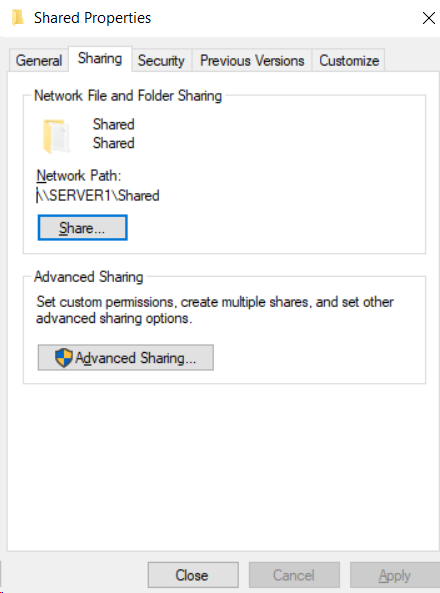
7. Öppna Group Policy Management, antinge via tools i Server Manager eller genom att skriva gpmc.msc i kommandotolken
8. Högerklicka på domänen och välj första alternativet  
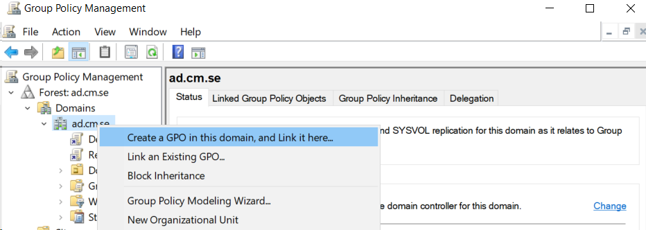
9. Döp den till t.ex. "Domain Users - Shared folder" och tryck på ok
10. Högerklicka på den GPO som du precis skapade och välj edit   
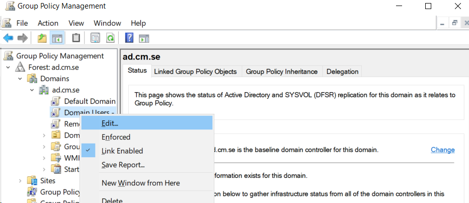
11. En ny ruta dyker upp och här ska vi arbeta med preferenserna i User Configuration
12. Gå till User Configuration > Preferences > Windows Settings
13. Högerklicka på Drive Maps och välj New > Mapped Drive  
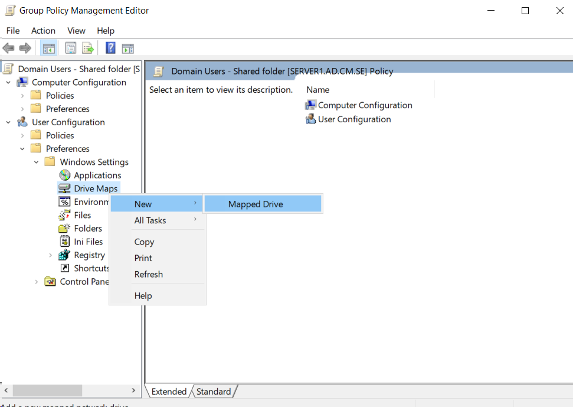
14. Nu ska följande ruta dyker upp  
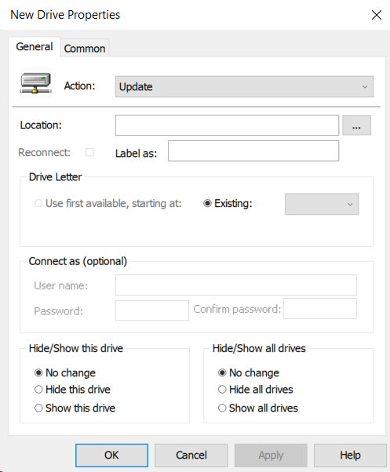
15. Ändra Action till Create  
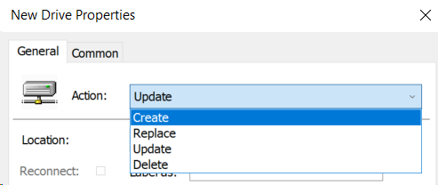
16. Klistra in Network Path som vi kopierade i steg 7
17. Checka i boxen för reconnect
18. Skriv in något passande namn för den delade mappen i "Label as:"
19. Välj en bokstav som driven ska få, S t.ex. (Undvik bokstäverna under F då de kan vara upptagna)
20. Klicka i "Show this drive" på båda ställena  
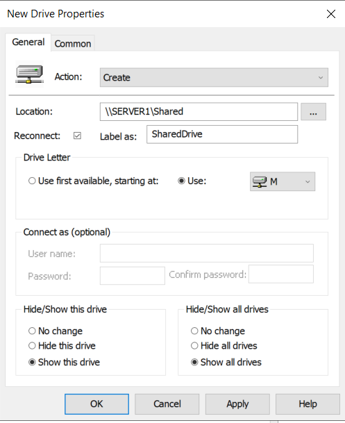
21. Gå nu in på "Common" fliken  
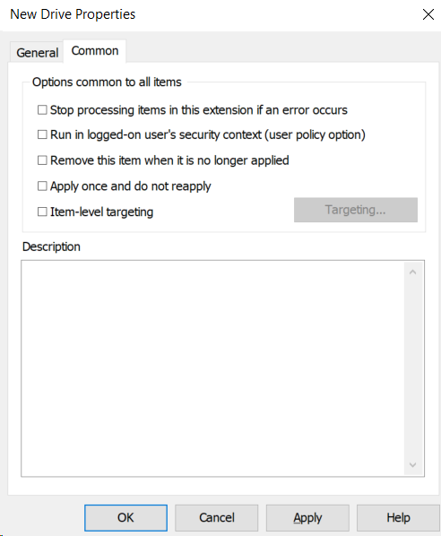
22. Checka i box nummer 2 och 5  
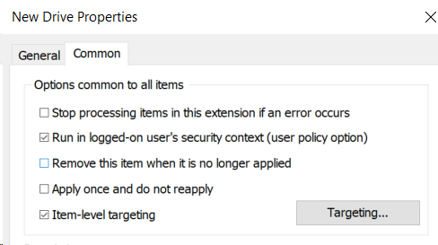
23. Klicka på Targeting 
24. En ny ruta dyker upp, här ska vi Lägge till New Item > Security Group  
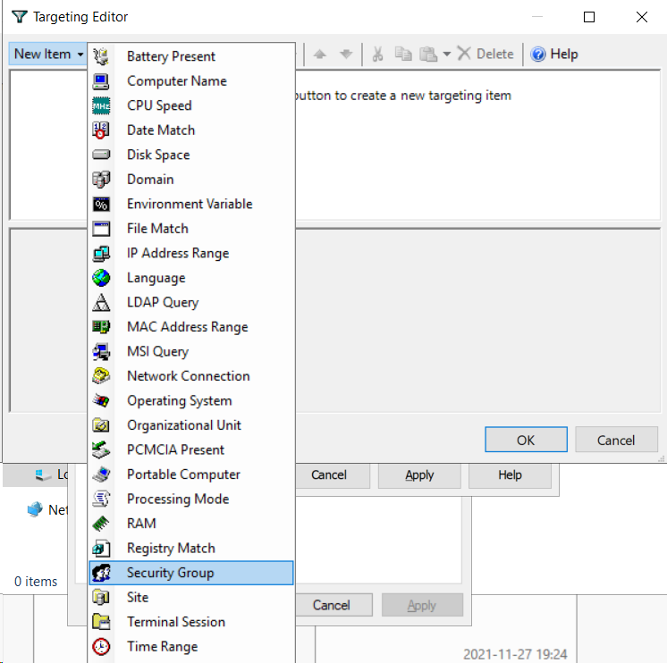 
25. Tryck på knappen med 3 punkter så att en ruta som heter Select Group kommer fram 
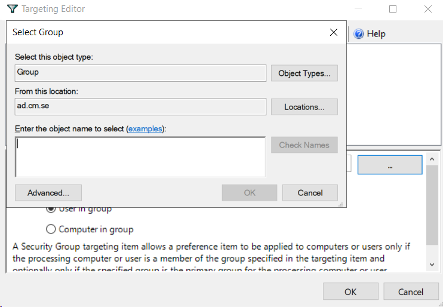
26. Vi vill lägga rättigheten på Domain Users så skriv in det och klicka på "Check Names" och sedan på ok 
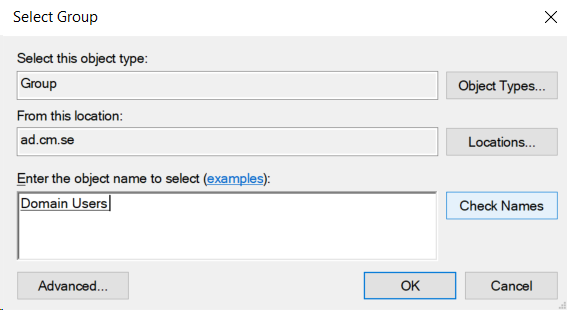 
    1.  Du kan skriva in en del av namnet och sedan trycka på "Check Names"
    2.  om många delar samma start får du välja mellan dem  
    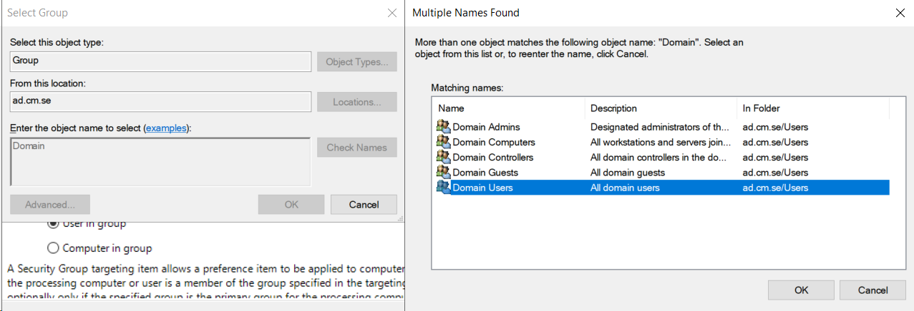
27. Klicka sedan ok i "Targeting Editor"
28. Klicka sedan på Apply och sedan ok i "New Drive Properties" fönstret.
29. Nu ska du se att en ny disk har dykt upp i Explorer  
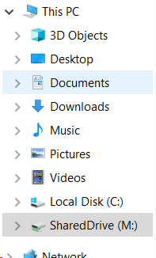
30. Logga in på ditt ad konto på din Client dator (Windows 10) och se om du kommer åt mappen där också.

Egentligen vill vi inte lägga en delad drive rakt på domänen för alla domänanvändare. Vi vill kunna skapa drives för våra OUs (Organizational Units)

Om du har flera OUs för olika användare kan du testa att skapa olika drives för dessa.
Tänk då på att den länkade GPOn ska ligga i rätt OU.

Instruktiv Video för att skapa delad drive med Group Policy Preferences: https://www.youtube.com/watch?v=tNpVvjR5QNA

# Installera programvara med Group Policy
https://www.kapilarya.com/deploy-software-using-group-policy-in-windows-server-2019

# Skapa en Extern switch i Hyper-v och dela ditt wifi din till domänkontrollant

# Installera Windows Admin Center på din Server
## 

# Installera programvara med Group Policy
https://www.kapilarya.com/deploy-software-using-group-policy-in-windows-server-2019